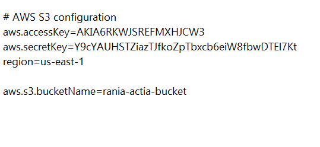
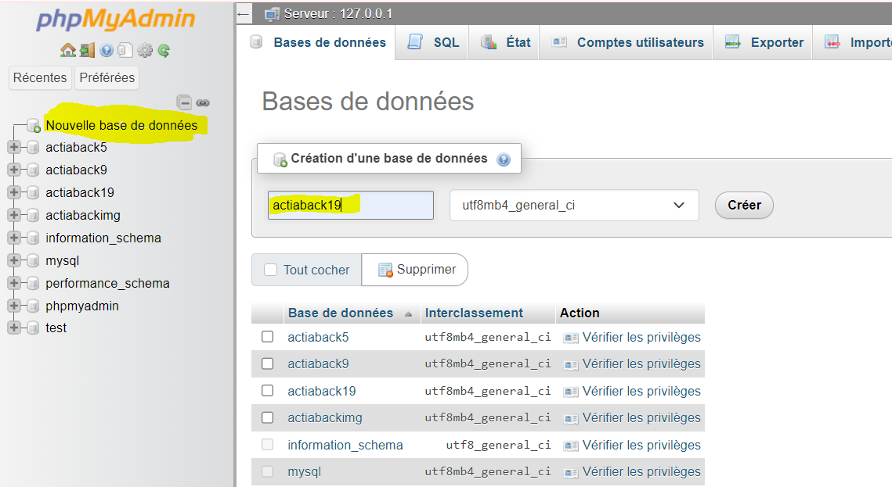
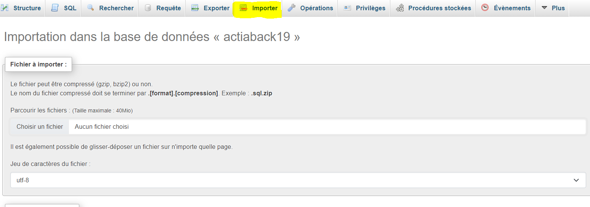

# Web-Based Tool for Jira API Integration

## Table of Contents
- [Introduction](#introduction)
- [Prerequisites](#prerequisites)
- [Installation](#installation)
  - [Frontend Setup](#frontend-setup)
  - [Backend Setup](#backend-setup)
- [Configuration](#configuration)
- [Running the Application](#running-the-application)
- [Running the Application with Docker](#running-the-application-with-docker)
- [Development Notes](#development-notes)
- [Contributing](#contributing)
- [License](#license)
- [Contact Information](#contact-information)

## Introduction

This project is a web-based tool designed to enhance Jira management by integrating with Jira APIs, providing an intuitive user interface, and offering additional functionalities to support various tasks. The application uses Angular for the frontend, Spring Boot for the backend, and Flask for handling Jira API requests.

## Prerequisites

Before you begin, ensure you have the following installed:

- **Node.js** (v20.17.0) [Download Node.js](https://nodejs.org/dist/v20.17.0/node-v20.17.0-x64.msi)
- **npm** (Comes with Node.js)
- **Angular CLI** (v18.2.0)
- **Java** (JDK 17 or later) [Download Java JDK](https://download.oracle.com/java/17/archive/jdk-17.0.10_windows-x64_bin.exe)
- **Maven** (v3.8.8) [Download Maven](https://dlcdn.apache.org/maven/maven-3/3.8.8/binaries/apache-maven-3.8.8-bin.zip)
- **Git**
- **Python 3.10** [Download Python](https://www.python.org/ftp/python/3.10.0/python-3.10.0rc2-amd64.exe)

## Installation

### Frontend Setup

1. **Clone the repository**:

    ```bash
    
    git clone --branch api-jira-version --depth 1 https://github.com/aestools-celad/StageJan2024Tools-SupportWebSite.git
    ```

2. **Navigate to the project directory**:

    ```bash
    cd StageJan2024Tools-SupportWebSite
    ```

3. **Add AWS configuration to `application.properties`** in `backend-backend\src\main\resources\application.properties`:


    ```properties
    aws.accessKey=YOUR_AWS_ACCESS_KEY
    aws.secretKey=YOUR_AWS_SECRET_KEY
    region=us-east-1
    aws.s3.bucketName=rania-actia-bucket
    ```

### Backend Setup

1. **Extract Maven**:

    - Download and extract the Apache Maven ZIP file from the official [Maven website](https://dlcdn.apache.org/maven/maven-3/3.8.8/binaries/apache-maven-3.8.8-bin.zip).
    - Extract the contents to a directory of your choice, for example, `C:\apache-maven-3.8.8`.

2. **Add Maven to System Environment Variables**:

    - Open **Control Panel** > **System and Security** > **System**.
    - Click on **Advanced system settings**.
    - Click **Environment Variables**.
    - Under **System variables**, find and select the `Path` variable, then click **Edit**.
    - Click **New** and add the path to the Maven `bin` directory, e.g., `C:\apache-maven-3.8.8\bin`.
    - Click **OK** to close all dialog boxes.

3. **Verify Maven Installation**:

    - Open Command Prompt and run the following command to verify that Maven is installed correctly:

    ```bash
    mvn -version
    ```

4. **Navigate to the backend directory**:

    ```bash
    cd backend-directory-path
    ```

## Configuration

1. **Jira API Integration**: Replace the placeholder in your Python scripts with your actual Jira Personal Access Token (PAT):

    ```python 
    #pat = "your_actual_jira_token_here"  # When running locally
    #pat = os.getenv('PAT')   #  When using Docker
    ```

2. **Database Server Configuration**:

    ```python
    # serverdb='mysqldb'  # When using Docker
    # serverdb='localhost'  # When running locally
    ```

## Running the Application

1. **Run XAMPP** (start Apache and MySQL), create a database, and import `actiaback19 (1).sql`.





2. **Initialize the projects**:
    - Run the following batch files to set up the environment:
      - `init_actia(front).bat`
      - `init_Backend.bat`
      - `initPython.bat`

3. **Start all projects**:

    - You can use `start_Allprojects.bat` to run all components or run them individually.

### Alternative Method

1. **Install Angular CLI**:

    ```bash
    npm install -g @angular/cli
    ```

2. **Install project dependencies**:

    ```bash
    npm update --force
    npm install --force 
    ```

3. **Run the Angular development server**:

    ```bash
    ng serve
    ```

4. **Run the Maven build**:

    ```bash
    mvn clean install
    ```

5. **Start the Spring Boot application**:

    ```bash
    mvn spring-boot:run
    ```


### Docker Setup(for created or updated images )

1. **Build Docker Images**:

    Use Docker Compose to build the images for the Angular frontend, Spring Boot backend, and Flask API:

    ```bash
    docker-compose build
    ```

2. **View the created or updated Docker images**:

    After building, you can list all Docker images to confirm the new or updated images:

    ```bash
    docker images
    ```

3. **Tag the images for Docker Hub**:

    Replace `<image_name>` and `<tag>` with appropriate names and tags for your images:

    ```bash
    docker tag <frontend_image_id> your_dockerhub_username/angular_frontend:<tag>
    docker tag <backend_image_id> your_dockerhub_username/spring_backend:<tag>
    docker tag <flask_image_id> your_dockerhub_username/flask_jira_api:<tag>
    ```

4. **Push the images to Docker Hub**:

    Log in to Docker Hub (if not already logged in) and push the images:

    ```bash
    docker login
    docker push your_dockerhub_username/angular_frontend:<tag>
    docker push your_dockerhub_username/spring_backend:<tag>
    docker push your_dockerhub_username/flask_jira_api:<tag>
    ```


## Running the Application with Docker

To run the application with Docker:

1. Ensure your `.env` file contains the Jira token in the following format:

    ```bash
    PAT="Token-here"
    ```

2. Start the application using Docker Compose:

    ```bash
    docker-compose up
    ```

- **Frontend**: Access the Angular application at `http://localhost:4200`.
- **Backend**: Access the Spring Boot API at `http://localhost:8080`.

## License

This project is licensed under the [MIT License](LICENSE).
